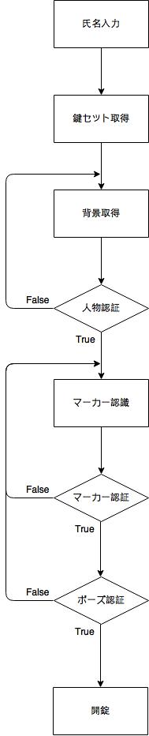
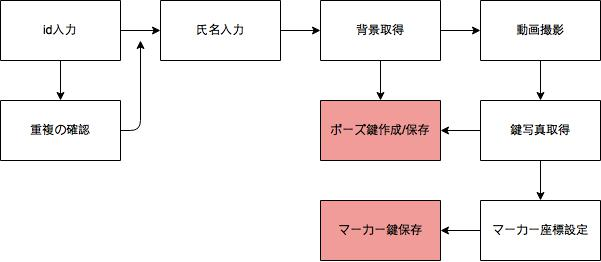

# インターンシップ ポーズ個人認証アプリ 機能仕様書

## バージョン

1.4

## 改版履歴

| 日付 | 版数 | 担当者 | 内容 |
| :--- | :--- | :---   | :--- |
| 2017/08/24 | 1.0 | 松岡 | 初版作成 |
| 2017/08/25 | 1.1 | 平間 | 内容更新(用語,構成,機能に追記) |
| 2017/08/28 | 1.2 | 松岡 | 内容更新(構成,機能に追記) |
| 2017/08/29 | 1.3 | 松岡 | 内容追加(はじめに,構成,機能に追記) |
| 2017/08/31 | 1.4 | 松岡 | 内容追加(機能に追記) |

## 用語

| 用語 | 説明 |
| :--- | :--- |
| ポーズ | 利用者が鍵を開ける際に撮影する任意の体勢 |
| ポーズ鍵 | 利用者が予め個人を識別するために設定したポーズのシルエット画像 |
| マーカー鍵 | 利用者が予め個人を識別するために設定したマーカーの座標 |

## 目次

1. はじめに
2. 構成 
3. 機能
    1. 氏名入力
    2. 人物認証
    3. マーカー認証
    4. ポーズ認証
4. 制限事項

## 1. はじめに
本アプリケーションは入室の際の鍵のマッチングを行うものである。鍵として用いるのは個々人が設定したポーズである。正確に利用者の取ったポーズを読み込めるように手にマーカーを持つことで識別しやすくする。   
利用方法としては、まず自身の識別番号(社員番号等を想定)を入力する。その後は正しい位置についた上で、事前に登録したものと同じポーズをとること認証が開始され、正しいと扉が開くというものとなっている。

## 2. 構成
- Windows7  
- python3.6.2  
- Webカメラ(iBUFFALO BSQ32KM04)  
- 専用マーカー(球体/赤)  

## 3. 機能
  

### 3.1 氏名入力
識別番号もしくは名前を入力することで、DB内から合致したマーカー鍵及びポーズ鍵を取得する機能。それぞれの鍵を後述するマーカー認証とポーズ認証にかけることで利用者本人であるかの判定を下す。  
DB内にはkeysetテーブルのみが存在しており、id(識別番号)、名前(英語表記)、マーカー鍵(左右の手につき左上/右下のXY座標)、ポーズ鍵で構成されている。いずれの値もnot null制約を、idにはさらにuniqueの制約を課している。
後述する鍵登録のプログラムによって新規データをDB上に残すことができる。

### 3.2 人物認証
画面に映ったものが人であるか否かを判断する機能。顔と全身を認識することで判断としている。

### 3.3 マーカー認証
手に持ったマーカーを認識し、マーカー鍵とマーカーの座標が一致するかを判断する機能。色、形での追跡を行う。3秒間の間、マーカー鍵に登録されている範囲内に収めることができたら認証される。

### 3.4 ポーズ認証
画面に映った利用者の取っているポーズを取得する機能。マーカー認証により正しい位置へと収まった利用者のシルエット画像を取得し、鍵として登録しているポーズ鍵との差分をとる。差分により得られた画像の白の画素数が特定数以下であった場合に認証される。  
認証された場合には「open」の文字列が、不認証の場合には「close」の文字列が表示される。

### 3.5 新規登録
DB上にないデータを登録する機能。別プログラムであるが、実行した際に表示される指示に従い進んでいくと新規登録されるものである。以下のフローチャートで示したような流れとなっている。  
  

## 4. 制限事項
**DB内データ**  
名前を登録する際は、統一性を保つため英語表記で行う

**カメラ**  
利用者の全身が映る位置に固定すること  
ポーズ判定は鍵を作成した際と同様の環境下で行うこと  
  
**撮影にあたって**  
足は鍵として設定した位置と同じ位置に置くこと  
背景はアプリ利用中に変化させないこと

以上

