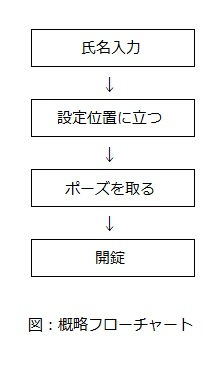

# インターンシップ XXXアプリ 機能仕様書

## バージョン

1.1

## 改版履歴

| 日付 | 版数 | 担当者 | 内容 |
| :--- | :--- | :---   | :--- |
| 2017/08/21 | 1.0 | 岩田 | 初版作成 |
| 2017/08/24 | 1.1 | 松岡 | 内容更新 |

## 用語

| 用語 | 説明 |
| :--- | :--- |
| ポーズ | 利用者が鍵を開ける際に撮るもの |
| 鍵 | 利用者が予め個人を識別するために設定したポーズ |

## 目次

1. はじめに
2. 構成 
3. 機能
    1. 人物認証
    2. マーカー認証
    3. ポーズ識別
    4. ポーズ認証
4. 制限事項

## 1. はじめに
　本アプリケーションは入室の際の鍵のマッチングを行うものである。鍵として用いるのは個々人が設定したポーズである。正確に利用者の取ったポーズを読み込めるように足の位置、手の位置はマーカーを用いて識別しやすくする。 
 
　この仕様書は不完全である。すべての内容は完成までに数回の改訂が必要だろう。

## 2. 構成

## 3. 機能

### 3.1 人物認証
　画面に映ったものが人であるか否かを判断する機能。顔と全身を認識することで判断としている。

### 3.2 マーカー認証
　手に持ったマーカーを認識し、鍵と座標が一致するかを判断する機能。色、形での追跡を行う。3秒間の間、鍵に登録されている範囲内に収めることができたら認証される。

### 3.3 ポーズ識別
　画面に映った利用者の取っているポーズを取得する機能である。マーカー認証により正しい位置へと収まった利用者のシルエットを背景との差分によって取得する。

### 3.4 認証
　前述したポーズ識別機能により取得されたポーズシルエットを用い、ポーズと鍵が一定値以上合致しているかを判断する機能である。動画からの複数枚のキャプチャーを元にポーズを平均化することで精度の向上を図っている。

## 4. 制限事項
**カメラ**  
利用者の全身が映る位置に固定すること  
ポーズ判定は鍵を作成した際と同様の環境下で行うこと  
  
**撮影にあたって**  
足は鍵として設定した位置と同じ位置に置くこと  
背景はアプリ利用中に変化させないこと

以上

